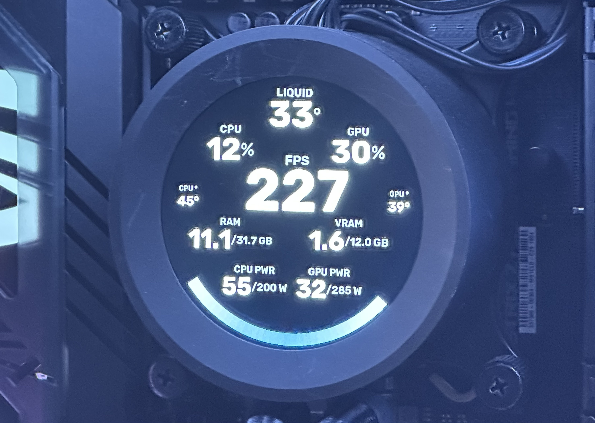

# Squid

Fork of [brokenmass/AIOLCDUnchained](https://github.com/brokenmass/AIOLCDUnchained) — SignalRGB bridge for NZXT Kraken LCDs (`SignalRGBLCDBridge.exe`).

WARNING: i'm not responsible for any damage to your equipment. If anything get stuck your best option is to turn off your pc and disconnect it from power for a minute or two before restarting it. Close **NZXT CAM** (and any other app that writes the Kraken LCD) before running the bridge.

This was tested SignalRGB v2.4.22. Recent SignalRGB versions have been really buggy with the Kraken LCDs. The plugin might work on newer versions when they will fix the issues.

## What’s different from upstream


|                  | Upstream                                           | Squid                                                                 |
| ---------------- | -------------------------------------------------- | --------------------------------------------------------------------- |
| Pause / shutdown | Canvas pause often left the LCD looping (esp. GIF) | Plugin pause / `Shutdown` blanks the LCD                              |
| Modes            | Canvas + simple overlay                            | `OFF` **·** `OVERLAY` **·** `MONITOR` **·** `GIF`                     |
| Monitor HUD      | Liquid / spinner overlay                           | Editable multi-widget HUD (CPU/GPU, RAM/VRAM, power, FPS)             |
| Metrics          | AIO + light CPU                                    | **MSI Afterburner (MAHM)**, RTSS FPS fallback, nvidia-smi when needed |
| Editors          | Limited                                            | Local web UIs at `/monitor` and `/gif`                                |
| Frame path       | Python compose                                     | Rust `py_compose_encode` (blend + rotate + mask + Q565)               |

### MONITOR mode example (layout is customizable)



## Status

Upstream SignalRGB integration demo:

[](https://www.youtube.com/watch?v=-EUDxjzwlcg)

Squid adds MONITOR / GIF editors and tighter pause + metrics behavior on top of that bridge.

## Installation

1. Close NZXT CAM / other proprietary Kraken LCD software.
2. Download the latest `SignalRGBLCDBridge.exe` from [GitHub Releases](../../releases).
3. Run the executable — it adds an icon to the **systray** (left-click for menu). On first run it installs the SignalRGB plugin under `Documents\WhirlwindFX\Plugins\KrakenLCDBridge\`.
4. Restart **SignalRGB** and add / enable **Kraken LCD Bridge** on the canvas.

Leave the tray app running while you use SignalRGB. The plugin talks to `http://127.0.0.1:30003` and does **not** start the bridge by itself.

Optional: start the exe at Windows logon (Startup folder / scheduled task) so it is always available with SignalRGB.

## Development

You must have **Python 3.14**, **Rust**, and **[uv](https://github.com/astral-sh/uv)** on **Windows** (WinUSB — not WSL/macOS for hardware).

Checkout the repository or download the latest code and install python dependencies:

```
uv venv --python 3.14
.\.venv\Scripts\Activate.ps1
uv pip install -r requirements.txt
```

Build and install the q565 / compose Rust extension:

```
maturin build --release
uv pip install (Get-ChildItem .\target\wheels\q565_rust-*-win_amd64.whl).FullName --force-reinstall
```

Build a release exe (windowed, no console):

```
.\build.ps1
```

Output: `dist\SignalRGBLCDBridge.exe`

Optional unit tests (no USB):

```
PYTHONPATH=. python -m pytest tests/test_metrics.py -q
```


## Usage

Ensure NZXT CAM / Other proprietary software is closed and start one of the available functions:

### Write GIF demo:

Writes a gif (static or animated) to the device

```
python writeGif.py path/to/your/file.gif
```


### Rotating demo:

Simple animation with frames generated in realtime:

```
python rotating.py
```


### Screencap demo:

Captures an area of your screen and renders it in the kraken elite lcd

```
python screencap.py
```


### SignalRGB bridge:

Receives a canvas section from SignalRGB, optionally composes MONITOR / OVERLAY / GIF, and displays it on the device

```
python signalrgb.py
```

Or run the packaged `SignalRGBLCDBridge.exe` (systray, no console).

In SignalRGB, device **FPS** is under Settings; composition mode, orientation, editor URLs, and overlay knobs are under **Lighting**:


| Mode        | Behavior                                                    |
| ----------- | ----------------------------------------------------------- |
| **OFF**     | Canvas path without squid HUD/GIF composition               |
| **OVERLAY** | Classic canvas + liquid / spinner-style overlay             |
| **MONITOR** | Multi-widget HUD — edit at `http://127.0.0.1:30003/monitor` |
| **GIF**     | GIF with pan/zoom — edit at `http://127.0.0.1:30003/gif`    |


Tray menu: device status, bridge FPS, Monitor editor, GIF editor, Exit.

## Images

Remote desktop icons created by fzyn - Flaticon [https://www.flaticon.com/free-icons/remote-desktop](https://www.flaticon.com/free-icons/remote-desktop)  
Kraken device images taken from NZXT website

## License

MIT License

Copyright (c) 2023 Marco Massarotto

Permission is hereby granted, free of charge, to any person obtaining a copy
of this software and associated documentation files (the "Software"), to deal
in the Software without restriction, including without limitation the rights
to use, copy, modify, merge, publish, distribute, sublicense, and/or sell
copies of the Software, and to permit persons to whom the Software is
furnished to do so, subject to the following conditions:

The above copyright notice and this permission notice shall be included in all
copies or substantial portions of the Software.

THE SOFTWARE IS PROVIDED "AS IS", WITHOUT WARRANTY OF ANY KIND, EXPRESS OR
IMPLIED, INCLUDING BUT NOT LIMITED TO THE WARRANTIES OF MERCHANTABILITY,
FITNESS FOR A PARTICULAR PURPOSE AND NONINFRINGEMENT. IN NO EVENT SHALL THE
AUTHORS OR COPYRIGHT HOLDERS BE LIABLE FOR ANY CLAIM, DAMAGES OR OTHER
LIABILITY, WHETHER IN AN ACTION OF CONTRACT, TORT OR OTHERWISE, ARISING FROM,
OUT OF OR IN CONNECTION WITH THE SOFTWARE OR THE USE OR OTHER DEALINGS IN THE
SOFTWARE.